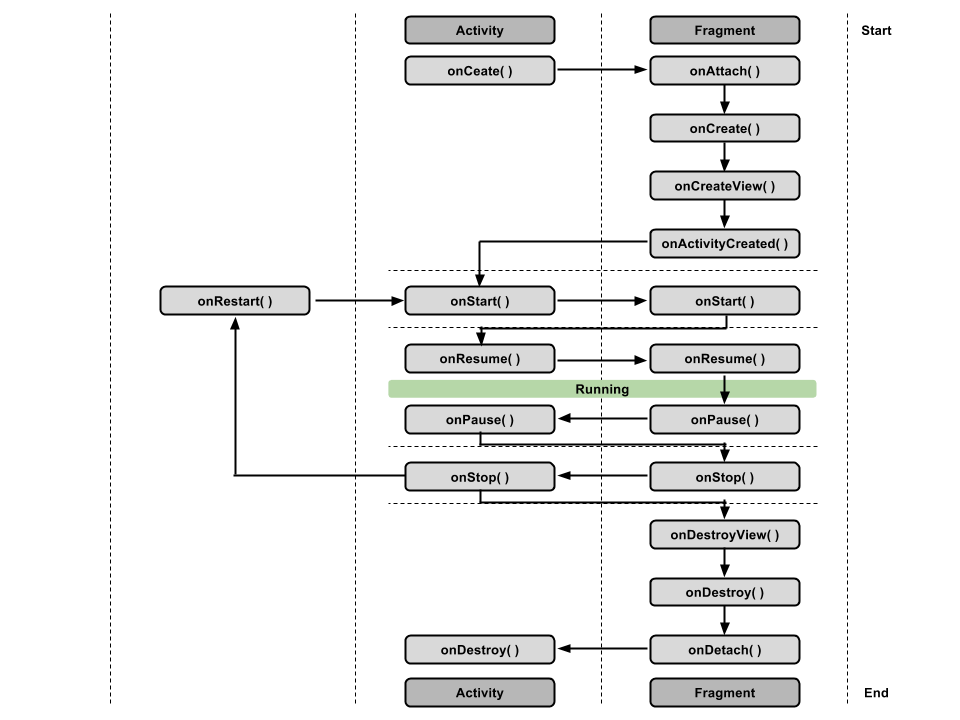

# Android Fragments
Es un mecanismo de Android para reutilizar una porción de una actividad y define parte de la interfaz de usuario. Los fragmentos deben ser enbedidos en las actividades ya que no existen de forma independiente.
> Las actividades deben heredear de FragmentActiviy o de AppCompatActivity para poder utilizar fragmentos.

A tener en cuenta:

* Un fragmento es una combinación de una vista (layout) y una clase que encapsulta la lógica.
* Usando las librerías de soporte (v4/ v7...) permiten que los fragmentos sean soportados por versiones anteriores.

Importantes por:

* Permiten reutilizar vistas y lógica.
* Permiten dar soporte a tablets.
* Permiten dar soporte a las distintas orientaciones de pantalla (portrait/ landscape).

Los fragmentos se pueden utilizar de forma estática o de forma dinámica.

* Para definirlos de forma estática basta con incluirlos en el layout
```xml
<fragment
    android:name="com.example.android.FooFragment"
    android:id="@+id/fooFragment"
    android:layout_width="match_parent" 
    android:layout_height="match_parent" />
```
* Para definirlos de forma dinámica debemos hacer uso de FragmentManager y de placeholders (normalmente FrameLayout)
```xml
 <FrameLayout
       android:id="@+id/your_placeholder"
       android:layout_width="match_parent"
       android:layout_height="match_parent"/>
```
```csharp
var transaction = SupportFragmentManager.BeginTransaction();
transaction.Replace(Resource.Id.your_placeholder, FooFragment.NewInstance());
transaction.commit();
```
Otro aspecto importante a tener en cuenta es que los fragmentos tienen, al igual que las actividades, ciclo de vida que no bien manejado puedes ser un foco de problemas.



Atención especial a OnViewCreated ya que es aquí dónde se debe hacer el setup de la vista.

> Respecto a lo del foco de problemas, el ejemplo es claro, una propiedad de un fragmento que ha sido asignada se pierde por ejemplo al cambiar la orientación del dispositivo. Para evitarlo existen mecanismos como guardar dichas variables en OnSaveInstanceState y recuperarlas en OnCreate.

```csharp
public override void OnSaveInstanceState(Bundle outState)
{
    //Todas las variables locales las guardamos en el Bundle para posteriormente recuperarla en el OnCreate
    outState.PutString(Constants.TagPlayers, JsonConvert.SerializeObject(Players));

    base.OnSaveInstanceState(outState);
}

public override void OnCreate(Bundle savedInstanceState)
{
    base.OnCreate(savedInstanceState);

    //Recuperamos las variables guardadas en OnSaveInstanceState
    var value = savedInstanceState?.GetString(Constants.TagPlayers, string.Empty);
    if (!string.IsNullOrEmpty(value))
        Players = JsonConvert.DeserializeObject<IEnumerable<Player>>(value);
}
```
Comunicación con los fragmentos. Existen tres formas de comunicación en los que un fragmento y una actividad pueden comunicarse.
    
* A través de Bundles, al crear un fragmento se le pueden asignar argumentos.
* A través de métodos, la actividad puede llamar a métodos de instancia de unfragmento.
* A través de eventos que emite el fragmento.

Resumiendo:

* Las actividades pueden inicializar fragmentos con datos durante su construcción.
* Las actividades pueden pasar parámetros a los fragmentos a través de métodos de instancia.